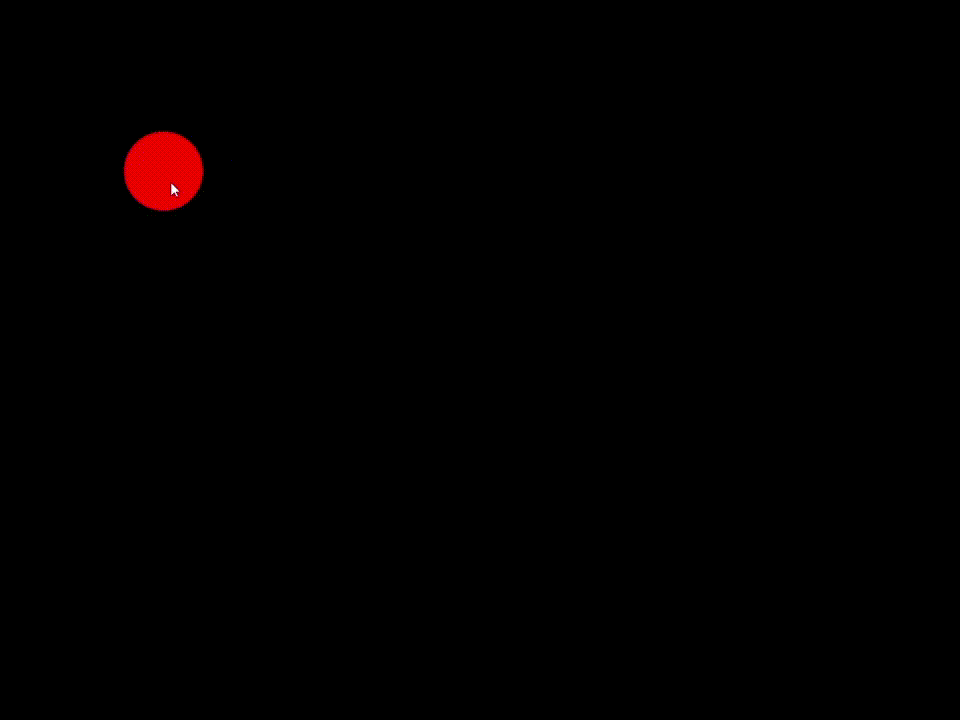
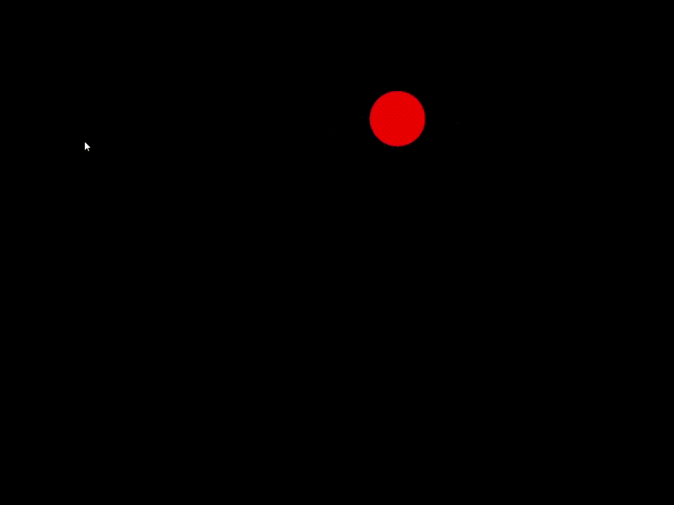
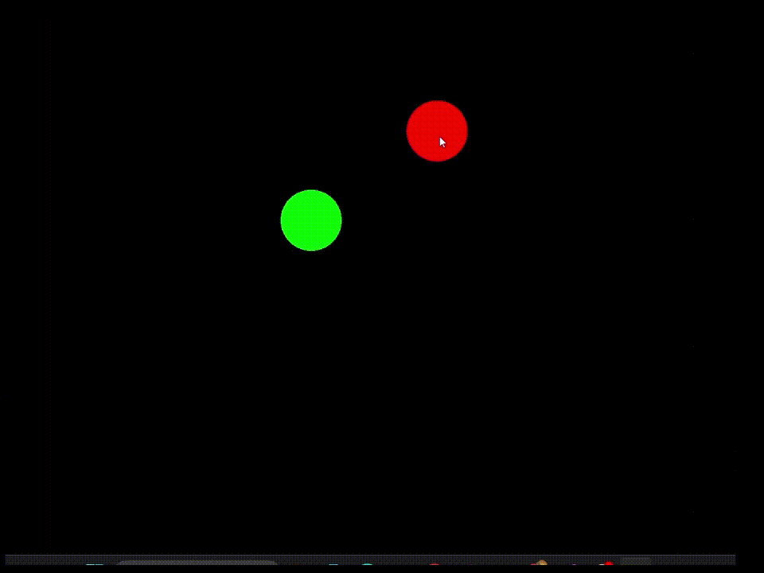

# 2D Billiard Ball Simulation

## A small simulation of 2d balls

This was made as a learning exercise. I wanted to improve my C++ and use SFML (and maybe learn some physics in the process). It has a simple collision system for balls of equale size and weight,

## Using the app

When statring everything you will be greated by a red dot. That is the first ball which is automatically placed down for you.

You can move balls by holding the left mouse button on top of a ball (which will pause the simulation). When the left mouse button is released, the ball will be shot in the opposite direction to the mouse curser.
The further the cursor is the stronger the velocity of the ball.

You can spawn a new ball by pressing the right mouse button

## Collision

When 2 balls will occupy the same space next frame, the programm will simulate an elastic collision between them. An elastic collision is one in which the kinetic energy
of the system is conserved before and after impact.

